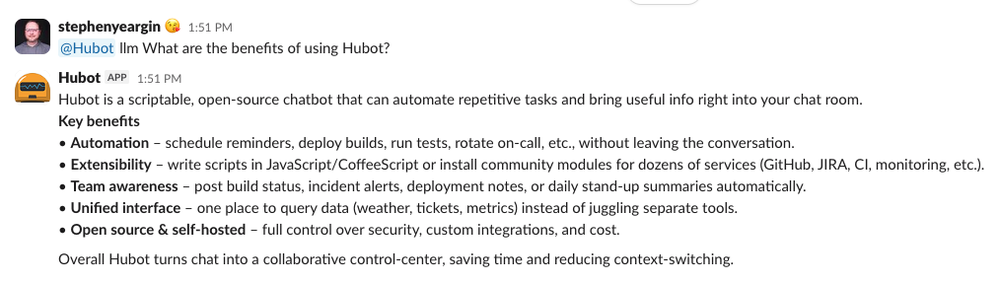

# hubot-ollama

[](https://github.com/stephenyeargin/hubot-ollama/actions/workflows/nodejs.yml)

> Hubot script for integrating with [Ollama](https://ollama.ai/) - run local or cloud LLMs in your chat.



## Quick Start
1. Install Ollama and pull a model:
   ```bash
   # Install Ollama from https://ollama.com
   ollama pull llama3.2
   # Ollama server starts automatically on macOS/Windows.
   # On Linux, start manually (or enable the systemd service):
   #   ollama serve
   #   sudo systemctl enable --now ollama
   ```
2. Add this package to your Hubot:
   ```bash
   npm install hubot-ollama --save
   ```
   Then add to `external-scripts.json`:
   ```json
   ["hubot-ollama"]
   ```
3. Start chatting:
   ```text
   hubot ask what is an LLM?
   hubot ollama explain async/await
   hubot llm write a haiku about databases
   ```

## Commands
| Pattern | Example | Notes |
|---------|---------|-------|
| `hubot ask <prompt>` | `hubot ask what is caching?` | Primary documented command |
| `hubot ollama <prompt>` | `hubot ollama summarize HTTP` | Alias |
| `hubot llm <prompt>` | `hubot llm list json benefits` | Alias |

Prompts are sanitized and truncated if they exceed the configured limit.

## Configuration
| Variable | Required | Default | Purpose |
|----------|----------|---------|---------|
| `HUBOT_OLLAMA_MODEL` | Optional | `llama3.2` | Model name (validated: `[A-Za-z0-9._:-]+`) |
| `HUBOT_OLLAMA_HOST` | Optional | `http://127.0.0.1:11434` | Ollama server URL |
| `HUBOT_OLLAMA_API_KEY` | Optional | (unset) | API key for [Ollama cloud](https://ollama.com/settings/keys) access. `OLLAMA_API_KEY` is also accepted as a fallback |
| `HUBOT_OLLAMA_SYSTEM_PROMPT` | Optional | Built‑in concise chat prompt | Override system instructions |
| `HUBOT_OLLAMA_MAX_PROMPT_CHARS` | Optional | `2000` | Truncate overly long user prompts |
| `HUBOT_OLLAMA_TIMEOUT_MS` | Optional | `60000` (60 sec) | Abort request after this duration |
| `HUBOT_OLLAMA_CONTEXT_TTL_MS` | Optional | `600000` (10 min) | Time to maintain conversation history; `0` to disable |
| `HUBOT_OLLAMA_CONTEXT_TURNS` | Optional | `5` | Maximum number of conversation turns to remember |
| `HUBOT_OLLAMA_CONTEXT_SCOPE` | Optional | `room-user` | Context isolation: `room-user`, `room`, or `thread` |
| `HUBOT_OLLAMA_RESPOND_TO_ADDRESSED_FALLBACK` | Optional | `false` | Enable fallback replies for addressed messages when no other listener matched |
| `HUBOT_OLLAMA_AMBIENT_CONTEXT` | Optional | `false` | Passively capture recent room messages as background context for answers |
| `HUBOT_OLLAMA_AMBIENT_CONTEXT_SIZE` | Optional | `10` | Number of recent ambient messages to retain per room |
| `HUBOT_OLLAMA_COMMAND_TOOL_ENABLED` | Optional | `false` | Allow the LLM to invoke other Hubot commands on the user's behalf and read the response |
| `HUBOT_OLLAMA_JS_REPL_ENABLED` | Optional | `false` | Allow the LLM to execute JavaScript in a sandboxed REPL |
| `HUBOT_OLLAMA_MEMORY_ENABLED` | Optional | `true` | Allow the LLM to save/recall persistent memories via `robot.brain` |
| `HUBOT_OLLAMA_MEMORY_MAX_ENTRIES` | Optional | `200` | Max memory entries per context scope before least-recently-accessed eviction |
| `HUBOT_OLLAMA_MEMORY_MAX_CONTENT_CHARS` | Optional | `4000` | Max characters stored per memory entry |
| `HUBOT_OLLAMA_MEMORY_MAX_SUMMARY_CHARS` | Optional | `200` | Max characters for a memory's summary |
| `HUBOT_OLLAMA_WEB_ENABLED` | Optional | `false` | Enable web-assisted workflow that can search/fetch context |
| `HUBOT_OLLAMA_WEB_MAX_RESULTS` | Optional | `5` | Max search results to use (capped at 10) |
| `HUBOT_OLLAMA_WEB_FETCH_CONCURRENCY` | Optional | `3` | Parallel fetch concurrency |
| `HUBOT_OLLAMA_WEB_MAX_BYTES` | Optional | `120000` | Max bytes per fetched page used in context |
| `HUBOT_OLLAMA_WEB_TIMEOUT_MS` | Optional | `45000` | Timeout for the web phase per fetch |

Change model:
```bash
export HUBOT_OLLAMA_MODEL=mistral
```
Connect to remote Ollama server:
```bash
export HUBOT_OLLAMA_HOST=http://my-ollama-server:11434
```
Use Ollama cloud (requires [API key](https://ollama.com/settings/keys)):
```bash
export HUBOT_OLLAMA_HOST=https://ollama.com
export HUBOT_OLLAMA_API_KEY=your_api_key
export HUBOT_OLLAMA_MODEL=gpt-oss:120b  # Use a cloud model

# Note: The host should match what `ollama signin` configures.
# Some environments may use a region-specific or API-prefixed host.
# Check `ollama signin --verbose` if unsure.

```
Custom system prompt:
```bash
export HUBOT_OLLAMA_SYSTEM_PROMPT="You are terse; answer in <=200 chars."
```
Adjust conversation memory:
```bash
# Keep 10 turns for 30 minutes, shared across the room
export HUBOT_OLLAMA_CONTEXT_TURNS=10
export HUBOT_OLLAMA_CONTEXT_TTL_MS=1800000
export HUBOT_OLLAMA_CONTEXT_SCOPE=room
```

Enable addressed fallback mode:
```bash
export HUBOT_OLLAMA_RESPOND_TO_ADDRESSED_FALLBACK=true
```

Enable ambient context:
```bash
export HUBOT_OLLAMA_AMBIENT_CONTEXT=true
export HUBOT_OLLAMA_AMBIENT_CONTEXT_SIZE=15  # optional, default 10
```

### Addressed Fallback Mode
When `HUBOT_OLLAMA_RESPOND_TO_ADDRESSED_FALLBACK=true`, hubot-ollama can answer without `ask`/`ollama`/`llm` prefixes, but only as a fallback.

- It runs through Hubot `catchAll`, so it only triggers when no other listener matched first.
- In shared rooms, fallback only triggers when explicitly addressed by bot name or configured alias (for example: `hubot summarize this` or `! summarize this` when `!` is the alias).
- In Slack, `@mentions` are normalized to the alias character by the adapter, so alias-prefix messages are treated as bot-addressed.
- Single-token alias-prefix messages (for example: `! ping`) are treated as command misses and ignored.
- In direct messages/private chats, plain text is treated as addressed.
- Explicit commands still work exactly as before (`hubot ask ...`, `hubot ollama ...`, `hubot llm ...`).

## Examples
```text
hubot ask explain vector embeddings
hubot llm generate a short motivational quote
hubot ollama compare sql vs nosql
```

### Ambient Context
When `HUBOT_OLLAMA_AMBIENT_CONTEXT=true`, the bot passively listens to recent room conversation and uses it as background context when answering questions — without users needing to repeat themselves.

```text
Bob>   We have that conference in Tampa next week.
Alice> Hopefully we'll get some good sales leads.
Bob>   Yep, should be great.
Bob>   hubot ask What should I pack for the trip?
Hubot> Weather in Tampa next week looks to be sunny and warm. I'd skip the heavy suit.
```

- Opt-in only (`HUBOT_OLLAMA_AMBIENT_CONTEXT=false` by default)
- Only captures undirected room messages — messages addressed to the bot are excluded
- Stores the last `HUBOT_OLLAMA_AMBIENT_CONTEXT_SIZE` messages per room in a ring buffer (not persisted across restarts)
- Direct messages are never captured

### Web-Enabled Workflow
When `HUBOT_OLLAMA_WEB_ENABLED=true` and the connected Ollama host supports web tools, the bot registers `hubot_ollama_web_search` and the LLM can invoke it directly. The flow now is:
- Phase 1: The model chooses whether to call `hubot_ollama_web_search`.
- Phase 2: The tool performs `webSearch`, fetches top results in parallel, builds a compact context block, and returns it.
- Phase 3: The model incorporates the returned context into its final reply.
- Search/fetch progress has no dedicated status message of its own — it's covered by the thinking indicator described below. Duplicate web searches/fetches within the same interaction are skipped.
- If any URLs were fetched via `hubot_ollama_web_fetch` during the interaction, a single aggregated `🌐 Sources: ...` message is posted after the final answer (not while work is in progress), listing every URL fetched across the whole interaction — including across multiple searches/fetches — in one message.

### Slack Reactions And Status
When running with the Slack adapter, hubot-ollama uses reactions/status indicators on the triggering message:

- Slack's native "_App_ is thinking..." / "_App_ is running a tool..." status strip (via `assistant.threads.setStatus`) while the prompt is processed and while a tool call is actively executing, if the bot's Slack app supports it.
- Otherwise, falls back to emoji reactions on the triggering message: `💭` (`thought_balloon`) while the main prompt is being processed, `🛠️` (`hammer_and_wrench`) while a tool call is actively executing.

These are nice-to-have enhancements and require additional Slack app permissions beyond the base `chat:write` scope needed to post messages:

| Indicator | Requirement |
|---|---|
| Thinking status strip | "Agents & AI Apps" enabled in the Slack app config, plus `chat:write` (or the older `assistant:write`) scope |
| Emoji reactions | `reactions:write` scope |

If neither is available, the bot continues normally with no processing indicator at all.

Enable:
```bash
export HUBOT_OLLAMA_WEB_ENABLED=true
export HUBOT_OLLAMA_WEB_MAX_RESULTS=5
export HUBOT_OLLAMA_WEB_FETCH_CONCURRENCY=3
export HUBOT_OLLAMA_WEB_MAX_BYTES=120000
export HUBOT_OLLAMA_WEB_TIMEOUT_MS=45000
```

### Tool Integration
The bot uses a **two-call LLM workflow** to enable tools when supported by the model:

1. **Phase 1**: Model decides if a tool is needed to answer the question
2. **Phase 2**: Tool is executed (if selected) and results are captured
3. **Phase 3**: Model incorporates tool results into a natural conversational response

**Built-in Tools:**
- `hubot_ollama_get_current_time` - Returns the current UTC timestamp (always available)

**Configuration:**
| Variable | Required | Default | Purpose |
|----------|----------|---------|---------|
| `HUBOT_OLLAMA_TOOLS_ENABLED` | Optional | `true` | Enable tool support (`true`/`1` or `false`/`0`) |

Enable tool support (default):
```bash
export HUBOT_OLLAMA_TOOLS_ENABLED=true
```

Disable tool support (useful for models without tool capability):
```bash
export HUBOT_OLLAMA_TOOLS_ENABLED=false
```

**How It Works:**
- The bot automatically detects whether your selected model supports tools via `ollama show`.
- If tools are enabled AND the model supports them, the two-call workflow activates.
- If the model doesn't support tools or tools are disabled, the bot falls back to a single-call workflow.
- When a tool is invoked, the model can request data (like current time) to enhance its response.

**Command Tool (opt-in):**
When `HUBOT_OLLAMA_COMMAND_TOOL_ENABLED=true`, the bot registers `hubot_ollama_run_command`, letting the model
look up a command via `hubot_ollama_help`, silently run it on the user's behalf, and read the response to help
answer a question (e.g. "what projects are inflight" → runs `hubot project list`). Commands that look
state-changing (create/delete/rename/etc.) are refused unless the model was explicitly told by the user to
perform that exact action. This is disabled by default because it lets the LLM trigger other scripts' side
effects — only enable it if you trust the model/prompting setup and the scripts installed alongside it.
Invoked commands that respond asynchronously (e.g. acknowledge immediately, then send the real reply once a
non-awaited HTTP call finishes) get up to 10 seconds of quiet after their last reply chunk before the tool
gives up and reports no response.

```bash
export HUBOT_OLLAMA_COMMAND_TOOL_ENABLED=true
```

**JavaScript REPL Tool (opt-in):**
When `HUBOT_OLLAMA_JS_REPL_ENABLED=true`, the bot registers `hubot_ollama_run_javascript`, letting the model
execute arbitrary JavaScript in a sandboxed `node:vm` context to perform calculations or data transformations
it can't reliably do by reasoning alone. This is disabled by default because it lets the LLM run arbitrary
computation on the bot's host — only enable it if you trust the model/prompting setup and the runtime
environment the bot is deployed in.

```bash
export HUBOT_OLLAMA_JS_REPL_ENABLED=true
```

**Persistent Memory (on by default):**
The bot registers `hubot_ollama_memory`, a caching aid the model can use to avoid re-deriving, re-fetching, or
re-asking for the same information across conversations — e.g. a fact the user already gave it, or a slow tool
result worth reusing instead of recomputing. This is meant to make the bot more efficient, not to give users a
"remember this about me" command; the model decides on its own when caching something is worthwhile. The tool
supports four actions: `save`, `recall`, `list`, and `delete`. `list` returns only keys and summaries (cheap to
browse); `recall` returns the full content for a specific key. Memories are scoped using the same context key
as conversation history (see [Context Scopes](#conversation-context)), so privacy follows whatever
`HUBOT_OLLAMA_CONTEXT_SCOPE` is already configured — a `room-user` scope keeps memories private per user,
`room` shares them with everyone in the room. The model is instructed to only save information it's confident
is accurate (something explicitly stated or an already-verified tool result, never a guess), and saves that
look like passwords, API keys, tokens, or other credentials are rejected by a best-effort regex guardrail — it
catches common, recognizably-shaped pastes but is not a security boundary; don't rely on it to catch every
credential format. Each context scope holds at most `HUBOT_OLLAMA_MEMORY_MAX_ENTRIES` entries; past that, the
least-recently-accessed entry is evicted to make room for a new one.

```bash
export HUBOT_OLLAMA_MEMORY_ENABLED=false        # opt out (default: true)
export HUBOT_OLLAMA_MEMORY_MAX_ENTRIES=200
export HUBOT_OLLAMA_MEMORY_MAX_CONTENT_CHARS=4000
export HUBOT_OLLAMA_MEMORY_MAX_SUMMARY_CHARS=200
```

**Example Tool Interaction:**
```text
user> hubot ask what time is it in UTC?
hubot> (Phase 1: Model decides current time is needed)
       (Phase 2: Tool returns: 2025-12-05T14:30:45.123Z)
       (Phase 3: Model incorporates and responds)
       The current UTC time is 2:30:45 PM on December 5, 2025.
```

**Registering Custom Tools:**
Use the tool registry to add your own tools:

```javascript
const registry = require('hubot-ollama/src/tool-registry');

registry.registerTool('my_tool', {
  name: 'my_tool',
  description: 'A brief description of what this tool does',
  parameters: {
    type: 'object',
    properties: {
      param1: { type: 'string', description: 'The first parameter' }
    }
  },
  handler: async (args, robot, msg) => {
    // args: parsed arguments from the LLM
    // robot: Hubot robot instance
    // msg: Current message object, use msg.send() to output results while tool in use
    return { result: 'Tool output here' };
  }
});
```

### Conversation Context
Hubot remembers recent exchanges within the configured scope, allowing natural follow-up questions:

```text
alice> hubot ask what are the planets in our solar system?
hubot> Mercury, Venus, Earth, Mars, Jupiter, Saturn, Uranus, Neptune.

alice> hubot ask which is the largest?
hubot> Jupiter is the largest planet in our solar system.
```

**Context Scopes:**
- `room-user` (default): Each user has separate conversation history per room
- `room`: All users in a room share the same conversation history
- `thread`: Separate history per thread (for Slack-style threading)

Context automatically expires after the configured TTL (default 10 minutes). Set `HUBOT_OLLAMA_CONTEXT_TTL_MS=0` to disable conversation memory entirely.

**Automatic Token Optimization:**  
For longer conversations, Hubot automatically summarizes older turns while keeping recent ones verbatim. This reduces token usage without changing behavior or requiring configuration. The last 2 turns are always kept in full, while earlier turns are condensed into a compact summary. This happens transparently in the background and never blocks responses.

## Ollama Cloud

This package supports [Ollama's cloud service](https://ollama.com/cloud), which allows you to run larger models that wouldn't fit on your local machine. Cloud models are accessed via the same API but run on Ollama's infrastructure.

### Setup

1. Create an account at [ollama.com](https://ollama.com/signup)
2. Generate an [API key](https://ollama.com/settings/keys)
3. Run `ollama signin` to register the host with Ollama.com
4. Configure your environment:
   ```bash
   export HUBOT_OLLAMA_HOST=https://ollama.com
   export HUBOT_OLLAMA_API_KEY=your_api_key
   export HUBOT_OLLAMA_MODEL=gpt-oss:120b-cloud
   ```

### Available Models

Hubot-Ollama works with [any model supported by Ollama](https://ollama.com/search), whether running locally or in the cloud. You can switch models on the fly using `HUBOT_OLLAMA_MODEL`, making it easy to choose between speed, size, and capability.

> Cloud model availability changes over time. Check the model catalog at [Ollama.com](https://ollama.com/search?c=cloud) for the latest list.

Both local and cloud models share the same API, making the integration seamless regardless of where your model runs.

**Note:** Cloud models require network connectivity and count against your cloud usage. Local models remain free and private.

## Error Handling
| Situation | User Message |
|-----------|------------|
| Ollama server unreachable | Cannot connect to Ollama server message |
| Model missing | Suggest `ollama pull <model>` |
| Empty response | Specific empty response notice |
| Timeout | Indicates the configured timeout elapsed |
| API error | Surfaces error message |

## Security & Safety
- Uses official Ollama JavaScript library with proper API communication.
- Model name validation & prompt sanitization (strip control chars).
- When `HUBOT_OLLAMA_WEB_ENABLED=true`, web search results are fetched from external sites. Only the fetched pages — not your private prompts — are sent over the network.
- Web search/fetch requests are performed by Ollama's own hosted API (`ollama.webSearch`/`ollama.webFetch`), not by this bot directly — this code never opens a connection to a model-supplied URL itself. SSRF protection (blocking internal IPs, `file://`, cloud metadata endpoints, etc.) is therefore Ollama's responsibility, not this script's. This is expected when using [Ollama Cloud](https://ollama.com); if you point `HUBOT_OLLAMA_HOST` at a self-hosted Ollama instance, confirm it applies equivalent protections before enabling `HUBOT_OLLAMA_WEB_ENABLED`.
- Tool results (including fetched web content) are sent to the model with a distinct `tool` role, not `user` — this lets the model's own role-based trust hierarchy separate real user turns from external/tool data, on top of the `<tool_result>` framing. Once any interaction has pulled in web content, `hubot_ollama_run_command` refuses further state-changing commands for the rest of that interaction even if the model claims `confirmed: true`, since that confirmation could have been steered by injected content rather than the actual user.

## Troubleshooting
| Symptom | Check |
|---------|-------|
| No response | Check Hubot logs for errors; verify Ollama server is accessible |
| Connection refused | Ensure Ollama server is running (`ollama serve` or daemon) |
| Model not found | Run `ollama list` to see available models, then `ollama pull <model>` |
| Wrong server | Set `HUBOT_OLLAMA_HOST=http://your-server:11434` |
| Long delays | Try increasing `HUBOT_OLLAMA_TIMEOUT_MS` or use a faster model |
| Web tools not running | The connected Ollama host must support `webSearch`/`webFetch`; feature auto-skips when unavailable |
| No search performed | The model decided a web search was unnecessary; disable web workflow or ask explicitly |
| `Error: unauthorized` | If using a cloud model, you must run `ollama signin` to register the host |
| Other cloud auth issues | Verify your `HUBOT_OLLAMA_API_KEY` is valid at [ollama.com/settings/keys](https://ollama.com/settings/keys) |

## Development
Run tests & lint:
```bash
npm install
npm test
npm run lint
```

## License
MIT
